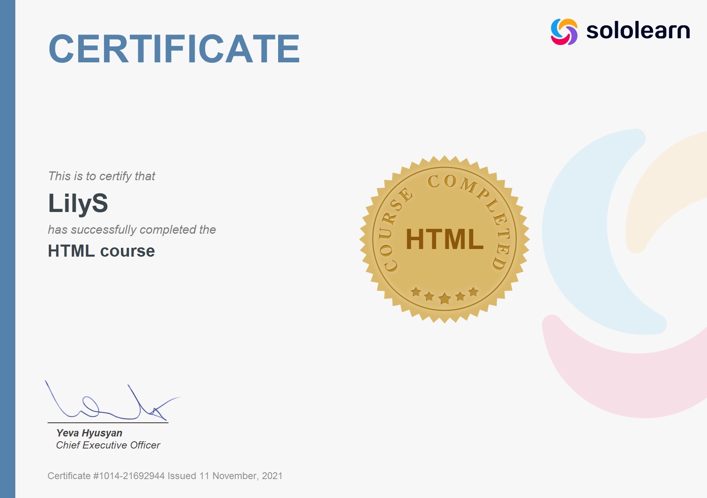

#### _What have I done earlier?_

I've worked like environmental engineer in different directions.
I did environmental education, environmental engineering surveys 
and purification of soils and groundwater from oil products.
I've done field work in difficult northern conditions and cameral work.

#### _Why did I decide to go in IT?_

It's important for me to be a part of technological progress.
I think technological progress can help to decide accumulated
problems of the modern world, including environmental ones.

#### _Where did I learn programming?_

1. [_Sololearn_](https://www.sololearn.com/home). This is popular place for self-study of various
programming languages. In each course, I've learned basic functions and features of the language, 
and then used them in practice.If I didn’t have enough materials, or some topics were not very clear,
I turned to numerous Internet resources and YouTube, and of course books.

- [X] Course HTML

- [X] Course CSS - 
- [X] Course JavaScript - 
- [X] Course Python for Beginners - 
- [ ] Course Python Intermediate - 

2. [_Академия АйТи_](https://academyit.ru). This is place where I've studied Python.

- [X] Course "Разработчик Python" - 272 hours

3. [_Geekbrains_](https://gb.ru/geek_university/analyst/ai-engineer-dp)

- [ ] Course "Инженер искусственный интеллект" - 

### _My skills_

Python, Django, SQL, HTML, CSS, JavaScript.

